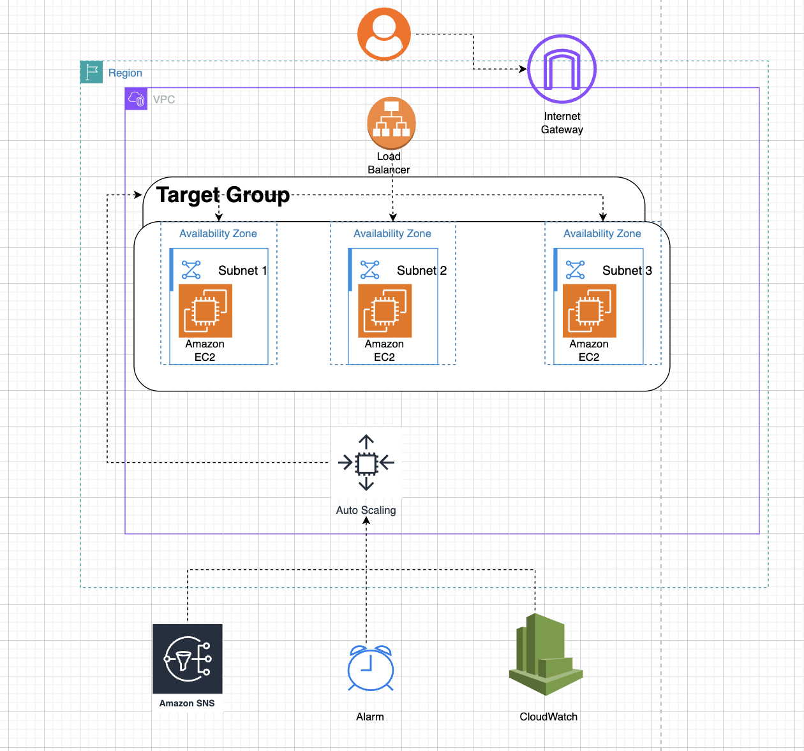
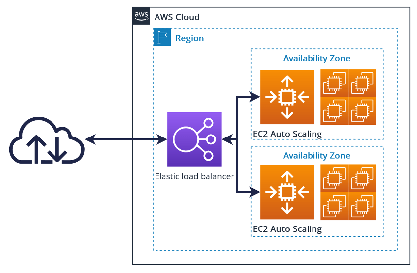
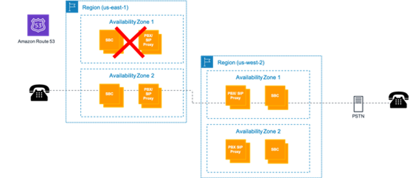
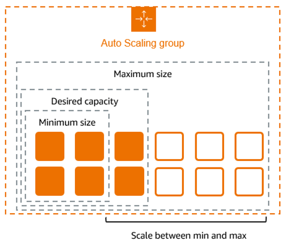
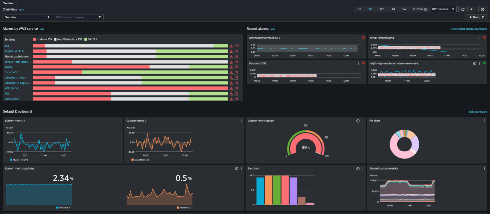

# AWS Highly Available Web Application

<!-- Shields.io Badges -->


A portfolio project demonstrating the design of a production-inspired, highly available AWS architecture with a focus on resilience, automatic recovery, health monitoring, and elastic scalability. This project showcases core AWS services working together to ensure robust application uptime and operational reliability.


---

## Highlights

- **High Availability**: Multi-instance deployment behind a load balancer for continuous uptime.
- **Fault Tolerance**: Automatic recovery from failed EC2 instances using Auto Scaling.
- **Elastic Scalability**: Dynamically adjusts compute capacity to handle traffic spikes.
- **Health Monitoring**: Real-time infrastructure health checks and alarms via CloudWatch.
- **Automated Recovery**: Unhealthy resources are detected and replaced automatically.
- **Security with IAM**: Follows AWS IAM best practices for secure resource access.
- **Production-inspired Architecture**: Mirrors patterns found in real-world resilient cloud deployments.

---

## Architecture



This architecture routes user requests from the Internet through an Elastic Load Balancer, which distributes traffic across multiple EC2 instances managed by an Auto Scaling Group. CloudWatch continuously monitors health and triggers alarms for failures, while SNS delivers notifications for operational events. IAM is used for secure access control.

### Core AWS Services

- Amazon EC2
- Amazon VPC
- Elastic Load Balancer (ELB)
- Auto Scaling Groups
- Amazon CloudWatch
- Amazon SNS
- AWS IAM

---

## Architecture Decisions

### Why an Elastic Load Balancer?
An Elastic Load Balancer distributes incoming requests across multiple EC2 instances to eliminate a single point of failure and improve availability.

### Why Auto Scaling?
Instead of relying on manual intervention, Auto Scaling automatically replaces unhealthy instances and adjusts capacity when demand changes.

### Why CloudWatch?
CloudWatch provides continuous infrastructure visibility, enabling automated health monitoring and operational alerting.

### Why SNS?
SNS delivers immediate notifications whenever critical infrastructure events occur, reducing response time during failures.

---

## Request Flow

1. **User Request:** A user accesses the web application from the Internet.
2. **Load Balancing:** The Elastic Load Balancer (ELB) receives the request and distributes it to one of the healthy EC2 instances.
3. **Application Processing:** The EC2 instance processes the request and serves the application content.
4. **Health Checks:** The ELB performs health checks on EC2 instances; if an instance is unhealthy, it is removed from rotation.
5. **Auto Scaling Replacement:** The Auto Scaling Group detects failed or unhealthy instances and automatically launches replacements to maintain desired capacity.
6. **Monitoring:** CloudWatch monitors metrics such as instance health, CPU utilization, and triggers alarms on anomalies.
7. **Notifications:** When an alarm is triggered (e.g., instance failure), CloudWatch sends an alert to an SNS topic, notifying subscribers (such as administrators).

---

## Features

### Availability
- Multi-AZ deployment for continuous uptime
- Elastic Load Balancer distributes all incoming traffic

### Scalability
- Auto Scaling Group automatically adjusts EC2 instance count
- Handles changing workloads and traffic spikes seamlessly

### Monitoring
- CloudWatch monitors health and performance metrics
- Alarms set for critical events (e.g., instance failures)
- SNS notifications for real-time alerts

### Security
- IAM roles and policies restrict resource access
- Principle of least privilege applied

### Reliability
- Automatic replacement of failed EC2 instances
- Health checks ensure only healthy instances serve traffic
- Operational resilience through automation

---

## Project Screenshots

Below are key screenshots highlighting important stages in the architecture's operation and resilience.

### Step 1 — Architecture Overview
This diagram visualizes the overall AWS infrastructure, showing how services like EC2, ELB, Auto Scaling, CloudWatch, and SNS are integrated for high availability and reliability.


### Step 2 — Healthy Deployment
Demonstrates a running EC2 instance that is healthy and serving application traffic. This shows the baseline operational state under normal conditions.


### Step 3 — Simulated Failure
Illustrates a deliberate failure of one EC2 instance, used to test the system's fault tolerance and automatic recovery mechanisms.


### Step 4 — Automatic Recovery
Shows the Auto Scaling Group automatically launching a new EC2 instance to replace the failed one, ensuring the application remains available without manual intervention.


### Step 5 — Monitoring & Notification
Captures the CloudWatch alarm triggering on EC2 failure and the resulting SNS notification, demonstrating real-time monitoring and alerting for operational awareness.


---

## Failure Recovery Demonstration

To validate the system's resilience, an EC2 instance was intentionally terminated to simulate a failure. The Elastic Load Balancer detected the unhealthy instance and stopped routing traffic to it. The Auto Scaling Group automatically launched a replacement instance to maintain desired capacity. Throughout this process, CloudWatch detected the failure and triggered an alarm, which sent a notification to administrators via SNS. The application remained available to users, demonstrating seamless recovery and operational continuity.

---

## Challenges & Solutions

### Challenge: Prevent downtime after EC2 instance failure
**Solution:** Configured Elastic Load Balancer health checks together with an Auto Scaling Group so unhealthy instances are automatically removed from service and replaced.

### Challenge: Detect infrastructure failures quickly
**Solution:** Configured Amazon CloudWatch alarms integrated with Amazon SNS to deliver real-time notifications whenever critical infrastructure events occur.

### Challenge: Maintain scalability during changing workloads
**Solution:** Designed the architecture around elastic compute resources capable of automatically scaling while maintaining application availability.

---

## Key Takeaways

This project reinforced several production cloud engineering principles:

- Design for failure instead of assuming infrastructure will always remain healthy.
- Automate recovery whenever possible to reduce operational overhead.
- Build observability into systems from the beginning using monitoring and alerting.
- Separate traffic routing from compute resources for improved resiliency.
- Favor scalable architectures that can evolve without major redesign.
- Continuously validate infrastructure through health checks and automated recovery.

---

## Production Concepts Demonstrated

- High Availability
- Fault Tolerance
- Horizontal Scaling
- Health Checks
- Load Balancing
- Infrastructure Monitoring
- Alerting
- Operational Resilience
- Disaster Recovery Principles

---

## Business Value

This architecture demonstrates how cloud-native AWS services can reduce downtime, automate operational tasks, improve infrastructure reliability, and support scalable application growth while minimizing manual intervention. The design emphasizes operational excellence, resiliency, observability, and automation—core engineering principles used in modern production cloud environments.

---

## Future Improvements & Roadmap

### Infrastructure as Code
- Automate provisioning with Terraform or AWS CloudFormation
- Version control for infrastructure changes

### Containers
- Containerize application workloads with Docker
- Deploy and orchestrate containers using Amazon ECS or EKS

### Security
- Integrate AWS WAF for web application firewall protection
- Enable HTTPS with ACM certificates
- Implement more granular IAM policies

### Networking
- Use Route 53 for custom domain DNS management
- Multi-AZ and VPC subnet enhancements

### CI/CD
- Build automated deployment pipelines for continuous integration and delivery
- Integrate with AWS CodePipeline or GitHub Actions

### Observability
- Expand CloudWatch dashboards and custom metrics
- Implement log aggregation and tracing

---

## Documentation

This repository includes key documentation to help understand, deploy, and evaluate the architecture:
- `deployment-guide.md`: Step-by-step guide for provisioning and testing the solution.
- Architecture diagram (`architecture.png`, `architecture.drawio`): Visual and editable representations of the infrastructure.
- Screenshots: Evidence of system health, failure, recovery, and alerting.

---

## Technologies Used

| Service | Purpose |
| --- | --- |
| Amazon EC2 | Hosts application servers |
| Elastic Load Balancer | Distributes incoming traffic |
| Auto Scaling | Automatically replaces failed instances and scales capacity |
| Amazon CloudWatch | Monitors infrastructure health and triggers alarms |
| Amazon SNS | Sends operational notifications |
| IAM | Secures access using least-privilege principles |
| Amazon VPC | Provides isolated networking for infrastructure |

---

## Repository Structure

```
aws-highly-available-web-application/
│
├── README.md
├── LICENSE
├── .gitignore
│
├── docs/
│   ├── architecture.png
│   ├── architecture.drawio
│   ├── deployment-guide.md
│   └── screenshots/
│       ├── goodEC2.png
│       ├── badEC2.png
│       ├── autoscaling.png
│       └── cloudwatch+alarm+sns.png
│
└── assets/
```

---

## Skills Demonstrated

- AWS architecture & cloud engineering
- Infrastructure design for high availability and scalability
- Monitoring, alerting, and observability
- Linux server administration
- Networking fundamentals (VPC, subnets, security groups)
- IAM roles and access control
- Debugging cloud infrastructure
- Systems thinking and operational automation

---

## Author

**Phillip-Bryan Kouokam**

- Portfolio: [https://philbk.dev](https://philbk.dev)
- GitHub: [https://github.com/PhilBKouokam](https://github.com/PhilBKouokam)
- LinkedIn: https://www.linkedin.com/in/phillip-bryan-kouokam

---

## License

This project is licensed under the MIT License. See the [LICENSE](LICENSE) file for details.