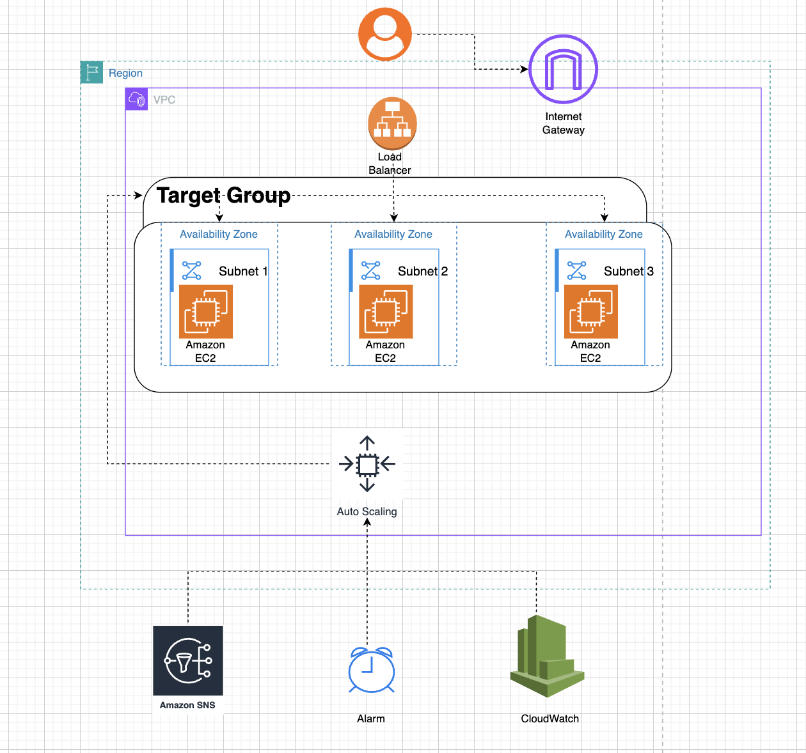
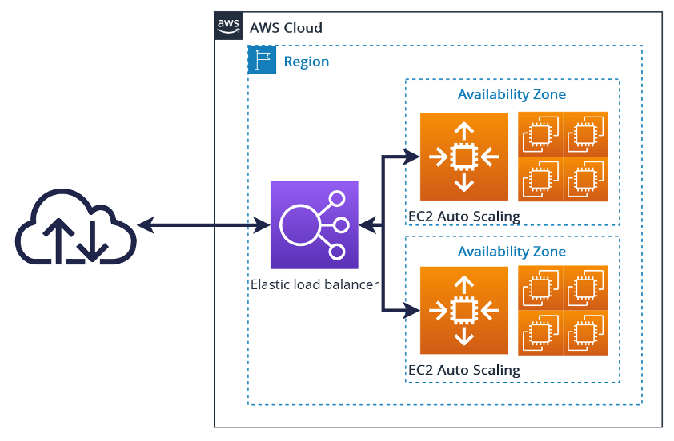
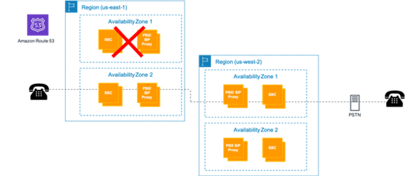
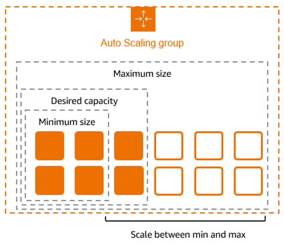
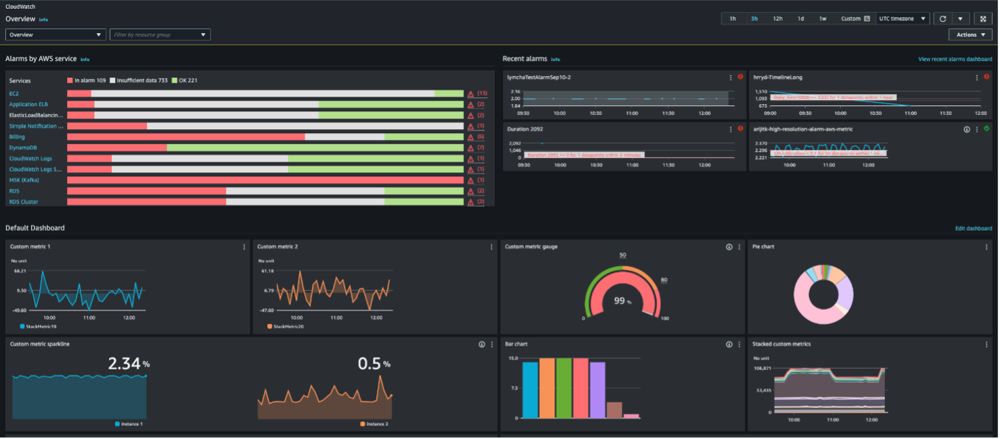

# AWS Highly Available Web Application

> Reliable software isn't just built through code. It's built through resilient systems.

A production-inspired AWS architecture designed to keep a web application available when individual compute resources fail. The project focuses on the operational behavior behind reliability: distributing traffic, detecting unhealthy capacity, restoring the desired state, and making failures visible to the people responsible for the system.

This repository is less about assembling a list of AWS services and more about showing how infrastructure components work together as a system. It reflects the way I approach full-stack engineering: application behavior, cloud architecture, and operations are connected parts of the same product experience.

<!-- Shields.io Badges -->


---

## Why I Built This

A web application can be well written and still be unreliable if its infrastructure depends on a single healthy server or a person noticing and repairing every failure. I built this project to explore the system around the application: how requests continue flowing, how failed capacity is replaced, and how operators learn that something changed.

The goal was not to claim production readiness from a small portfolio environment. It was to practice a production mindset in a focused scope and make the recovery path observable and testable.

---

## Highlights

- **Availability by design:** Requests are routed across healthy compute capacity instead of depending on a single instance.
- **Recovery as a system behavior:** Failed instances are removed from service and replacement capacity is launched automatically.
- **Operational visibility:** Health checks, metrics, alarms, and notifications make infrastructure state visible rather than leaving failure detection to users.
- **Elastic capacity:** Compute can adjust with demand while the load balancer provides a stable entry point for the application.
- **Deliberate failure testing:** Recovery was validated by terminating an instance and observing routing, replacement, and alerting behavior.
- **Explicit tradeoffs:** The design favors managed AWS primitives and a clear recovery path while acknowledging the additional work required for production-grade networking, security, deployment automation, and observability.

---

## Engineering Philosophy

Reliability is an end-to-end property. It depends on how software is deployed, how infrastructure responds to change, what happens when a dependency fails, and whether the team has enough information to act.

For this project, that meant designing for replaceable compute, separating traffic routing from individual servers, automating predictable recovery, and treating monitoring as part of the architecture rather than an add-on. It also meant keeping the design proportional to the problem: simple enough to understand and operate, but structured so stronger production controls can be added without changing its core model.

---

## Architecture



The architecture is organized around one operational objective: preserve service availability when compute capacity changes or fails.

An Elastic Load Balancer provides a stable entry point and sends requests only to healthy EC2 instances. The Auto Scaling Group manages those instances as replaceable capacity, restoring the desired count when an instance becomes unhealthy or is terminated. CloudWatch and SNS close the operational loop by turning infrastructure state into alarms and notifications, while IAM limits how resources and operators interact with the environment.

Each component has a narrow responsibility. Together, they create a recovery path that does not depend on a specific server surviving or on an operator completing the first remediation step manually.

### Core AWS Services

- Amazon EC2
- Amazon VPC
- Elastic Load Balancer (ELB)
- Auto Scaling Groups
- Amazon CloudWatch
- Amazon SNS
- AWS IAM

---

## Architecture Decisions

### Why an Elastic Load Balancer?
An Elastic Load Balancer distributes incoming requests across multiple EC2 instances to eliminate a single point of failure and improve availability.

### Why Auto Scaling?
Instead of relying on manual intervention, Auto Scaling automatically replaces unhealthy instances and adjusts capacity when demand changes.

### Why CloudWatch?
CloudWatch provides continuous infrastructure visibility, enabling automated health monitoring and operational alerting.

### Why SNS?
SNS delivers immediate notifications whenever critical infrastructure events occur, reducing response time during failures.

---

## Request Flow

1. **User Request:** A user accesses the web application from the Internet.
2. **Load Balancing:** The Elastic Load Balancer (ELB) receives the request and distributes it to one of the healthy EC2 instances.
3. **Application Processing:** The EC2 instance processes the request and serves the application content.
4. **Health Checks:** The ELB performs health checks on EC2 instances; if an instance is unhealthy, it is removed from rotation.
5. **Auto Scaling Replacement:** The Auto Scaling Group detects failed or unhealthy instances and automatically launches replacements to maintain desired capacity.
6. **Monitoring:** CloudWatch monitors metrics such as instance health, CPU utilization, and triggers alarms on anomalies.
7. **Notifications:** When an alarm is triggered (e.g., instance failure), CloudWatch sends an alert to an SNS topic, notifying subscribers (such as administrators).

---

## Features

### Availability
- Multi-AZ deployment for continuous uptime
- Elastic Load Balancer distributes all incoming traffic

### Scalability
- Auto Scaling Group automatically adjusts EC2 instance count
- Handles changing workloads and traffic spikes seamlessly

### Monitoring
- CloudWatch monitors health and performance metrics
- Alarms set for critical events (e.g., instance failures)
- SNS notifications for real-time alerts

### Security
- IAM roles and policies restrict resource access
- Principle of least privilege applied

### Reliability
- Automatic replacement of failed EC2 instances
- Health checks ensure only healthy instances serve traffic
- Operational resilience through automation

---

## Project Screenshots

Below are key screenshots highlighting important stages in the architecture's operation and resilience.

### Step 1 — Architecture Overview
This diagram visualizes the overall AWS infrastructure, showing how services like EC2, ELB, Auto Scaling, CloudWatch, and SNS are integrated for high availability and reliability.


### Step 2 — Healthy Deployment
Demonstrates a running EC2 instance that is healthy and serving application traffic. This shows the baseline operational state under normal conditions.


### Step 3 — Simulated Failure
Illustrates a deliberate failure of one EC2 instance, used to test the system's fault tolerance and automatic recovery mechanisms.


### Step 4 — Automatic Recovery
Shows the Auto Scaling Group automatically launching a new EC2 instance to replace the failed one, ensuring the application remains available without manual intervention.


### Step 5 — Monitoring & Notification
Captures the CloudWatch alarm triggering on EC2 failure and the resulting SNS notification, demonstrating real-time monitoring and alerting for operational awareness.


---

## Failure Recovery Demonstration

To validate the system's resilience, an EC2 instance was intentionally terminated to simulate a failure. The Elastic Load Balancer detected the unhealthy instance and stopped routing traffic to it. The Auto Scaling Group automatically launched a replacement instance to maintain desired capacity. Throughout this process, CloudWatch detected the failure and triggered an alarm, which sent a notification to administrators via SNS. The application remained available to users, demonstrating seamless recovery and operational continuity.

---

## Challenges & Solutions

### Challenge: Prevent downtime after EC2 instance failure
**Solution:** Configured Elastic Load Balancer health checks together with an Auto Scaling Group so unhealthy instances are automatically removed from service and replaced.

### Challenge: Detect infrastructure failures quickly
**Solution:** Configured Amazon CloudWatch alarms integrated with Amazon SNS to deliver real-time notifications whenever critical infrastructure events occur.

### Challenge: Maintain scalability during changing workloads
**Solution:** Designed the architecture around elastic compute resources capable of automatically scaling while maintaining application availability.

---

## Lessons Learned

Building the architecture reinforced that availability comes from coordinated behavior, not from any single service:

- A recovery mechanism is only useful when health signals accurately identify what should be replaced.
- Load balancing and replaceable compute remove attachment to individual servers, but they do not eliminate the need to understand application state.
- Automation reduces recovery time and operator toil; monitoring still matters because automated systems can fail in unexpected ways.
- Failure simulation is part of design validation. A diagram describes intent, while a controlled failure shows how the system actually behaves.
- High availability introduces cost and complexity. Redundancy, observability, and automation should match the impact of downtime and the needs of the product.
- This design addresses compute-layer resilience. A production system would also need deeper work across data durability, deployment safety, security, networking, and disaster recovery.

---

## Production Concepts Demonstrated

- High Availability
- Fault Tolerance
- Horizontal Scaling
- Health Checks
- Load Balancing
- Infrastructure Monitoring
- Alerting
- Operational Resilience
- Disaster Recovery Principles

---

## Business Value

Infrastructure decisions eventually become product outcomes. Removing unhealthy capacity from rotation protects users from known failures. Automated replacement shortens the period of reduced capacity. Alerts give operators context before a degraded condition becomes a prolonged incident. Elasticity also allows the system to respond to changing demand without sizing every environment for its highest possible load.

These benefits come with tradeoffs: redundant capacity increases cost, automation requires careful health checks, and alerts need tuning to remain useful. The value of this architecture is not complexity for its own sake; it is a clearer, faster, and more repeatable response to failure when availability matters to the product.

---

## Development Workflow

The project was developed as an architecture exercise with validation built into the workflow:

1. Define the availability goal and identify the single-instance failure mode.
2. Separate request routing from compute so unhealthy instances can leave service safely.
3. Configure desired capacity and automatic replacement behavior.
4. Add metrics, alarms, and notifications to make state changes visible.
5. Establish a healthy baseline before introducing failure.
6. Terminate an instance intentionally and observe traffic handling, detection, replacement, and notification.
7. Capture the results, document the decisions, and record the gaps between this implementation and a production system.

This workflow treats infrastructure changes like product changes: start with the behavior the system should provide, test that behavior under realistic conditions, and document both the outcome and the remaining risks.

---

## Future Improvements & Roadmap

### Infrastructure as Code
- Automate provisioning with Terraform or AWS CloudFormation
- Version control for infrastructure changes

### Containers
- Containerize application workloads with Docker
- Deploy and orchestrate containers using Amazon ECS or EKS

### Security
- Integrate AWS WAF for web application firewall protection
- Enable HTTPS with ACM certificates
- Implement more granular IAM policies

### Networking
- Use Route 53 for custom domain DNS management
- Multi-AZ and VPC subnet enhancements

### CI/CD
- Build automated deployment pipelines for continuous integration and delivery
- Integrate with AWS CodePipeline or GitHub Actions

### Observability
- Expand CloudWatch dashboards and custom metrics
- Implement log aggregation and tracing

---

## Documentation

This repository includes key documentation to help understand, deploy, and evaluate the architecture:
- `deployment-guide.md`: Step-by-step guide for provisioning and testing the solution.
- Architecture diagram (`architecture.png`, `architecture.drawio`): Visual and editable representations of the infrastructure.
- Screenshots: Evidence of system health, failure, recovery, and alerting.

---

## Technologies Used

| Service | Purpose |
| --- | --- |
| Amazon EC2 | Hosts application servers |
| Elastic Load Balancer | Distributes incoming traffic |
| Auto Scaling | Automatically replaces failed instances and scales capacity |
| Amazon CloudWatch | Monitors infrastructure health and triggers alarms |
| Amazon SNS | Sends operational notifications |
| IAM | Secures access using least-privilege principles |
| Amazon VPC | Provides isolated networking for infrastructure |

---

## Repository Structure

```
aws-highly-available-web-application/
│
├── README.md
├── LICENSE
├── .gitignore
│
├── docs/
│   ├── architecture.png
│   ├── architecture.drawio
│   ├── deployment-guide.md
│   └── screenshots/
│       ├── goodEC2.png
│       ├── badEC2.png
│       ├── autoscaling.png
│       └── cloudwatch+alarm+sns.png
│
└── assets/
```

---

## Skills Demonstrated

- AWS architecture & cloud engineering
- Infrastructure design for high availability and scalability
- Monitoring, alerting, and observability
- Linux server administration
- Networking fundamentals (VPC, subnets, security groups)
- IAM roles and access control
- Debugging cloud infrastructure
- Systems thinking and operational automation

---

## Author

**Phillip-Bryan Kouokam**

- Portfolio: [https://philbk.dev](https://philbk.dev)
- GitHub: [https://github.com/PhilBKouokam](https://github.com/PhilBKouokam)
- LinkedIn: https://www.linkedin.com/in/phillip-bryan-kouokam

---

## License

This project is licensed under the MIT License. See the [LICENSE](LICENSE) file for details.
